# Mystery Box Market

**<h2>Website</h2>**
https://www.mysteryboxmarket.space/

---

---

**<h2>Github</h2>**
https://github.com/Joshua-Tu/rails_team_project

---

---

**<h2>Contents<h2>**

**<h3>Section 1 About </h3>**

- Section 1.1 About Mystery Box Market

**<h3>Section 2 Design Documentation</h3>**

- Section 2.1 Design Process

- Section 2.2 User Stories

- Section 2.3 Workflow Diagram of the users Journey

- Section 2.4 Wireframes

- Section 2.5 Database Entity Relationship Diagram

**<h3>Section 3 Planning Process</h3>**

- 3.1 Project Plan and Time Line

- 3.2 Screen shots of Trello Board

**<h3>Section 4 Short Answer Questions</h3>**

- 4.1 Short Answer Questions

---

---

**<h2>Section 1 About Mystery Box Market<h2>**

</h3>Mystery Box Market is an online shopping platform for users to buy and sell mystery boxes to one another. There is a currently a gap in the market for mystery boxes that allow people to buy and sell to each other.

The issue with this is that rather than going onto shopping platforms to sell these items, we came up with a solution to allow like minded users who are specifically looking at buying or selling mystery boxes a platform in which they can do just that under a single roof.

Our applications features offer users to buy and sell mystery boxes directly to one another. As a community feature, we have added a way for other users to rate the seller based on the contents of the box they purchased, if it had some value or if it was utter rubbish.

Users need to be logged in and registered to be able to buy and sell these items.</h3>

---

**The tech stack we used to create this app include :**

---

- Ruby on rails for a web app framework.

- Github for version and source control.

- Slack for group communication.

- Trello for task management.

- Heroku for the use of a deployment platform.

- VSCode for code editting

- HTML, CSS, Javascript and Ruby for our programming languages.

- Bootstrap for page layout

- PostgreSQL for our database.

- AWS For Image Uploading

- Stripe for accepting payments online

---

Gems installed

---

gem "devise", "~> 4.6"

gem "faker", "~> 1.9"

gem "bootstrap", "~> 4.3"

gem "jquery-rails", "~> 4.3"

gem "aws-sdk-s3", "~> 1.36"

gem "stripe", "~> 4.16"

---

**Setting up the Application**

---

- Clone the files from the repo
- run the command
  - \$ gem install bundler.
  - For more information, visit https://bundler.io/.
- Move into the cloned directory
- run the command
  - \$ bundle install
    - bundle install installs all the gems located inside the gemfile for the project rather than individually installing each gem file.
- \$ rails db:create
- \$ rails db:migrate
- \$ rails s (To ensure the setup ran properly, go to your local host and type in http://127.0.0.1:3000/listings )
- If mystery box market renders onto the page, you are now up and ready to begin!

---

---

**<h2>Section 2 Design Documentation</h2>**

**Section 2.1 Design Process**

The design

- Section 2.1 Design Process

* Section 2.2 User Stories

  - Please refer to Section 4, Question 15.

* Section 2.3 Workflow Diagram of the users Journey
  User Workflow Diagram
  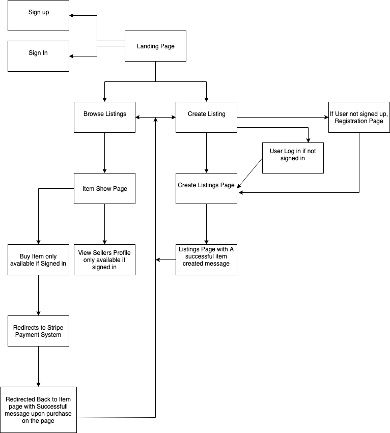

* Section 2.4 Wireframes

  - Please refer to Section 4, question 16.

* Section 2.5 Database Entity Relationship Diagram
  - Please refer to Section 4, question 14.

---

---

**<h2>Section 3 Planning Process</h2>**

**Section 3.1 Project Timeline**

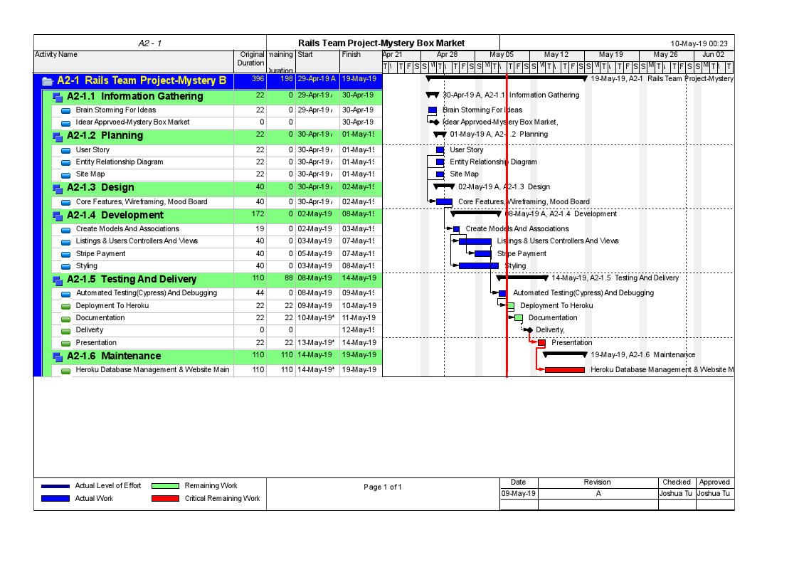

**Section 3.2 Screenshots of Trello Board(s)**

These screenshots depict the certain stages off our development process by keeping track of objectives through Trello. It was a good way to keep track of what needed to be done side by side with our Gantt Chart.

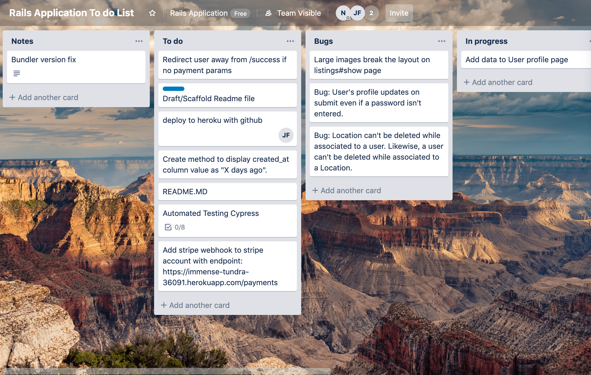
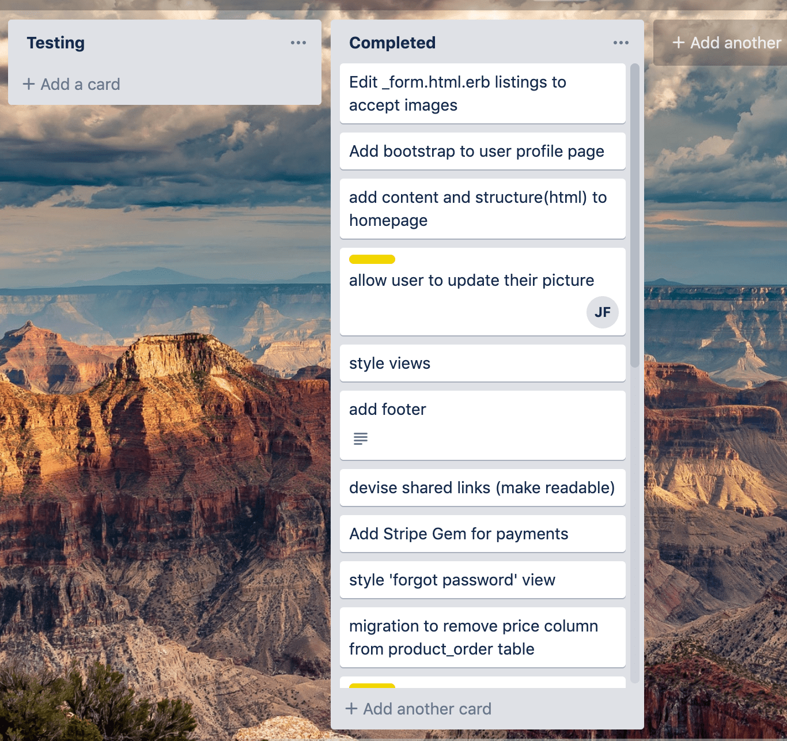
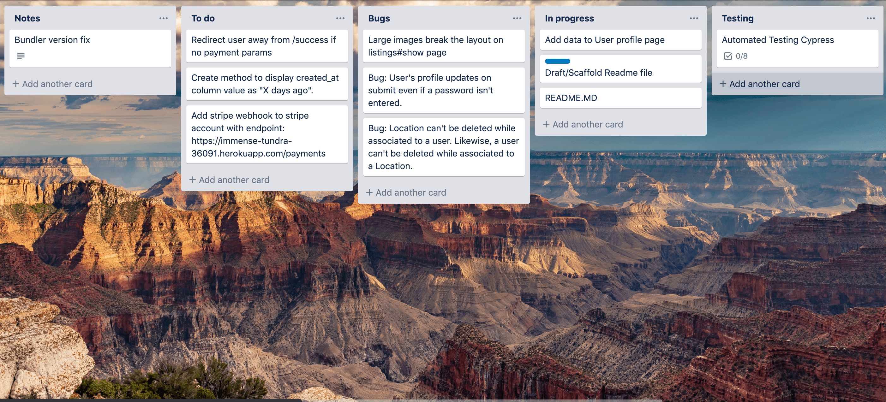
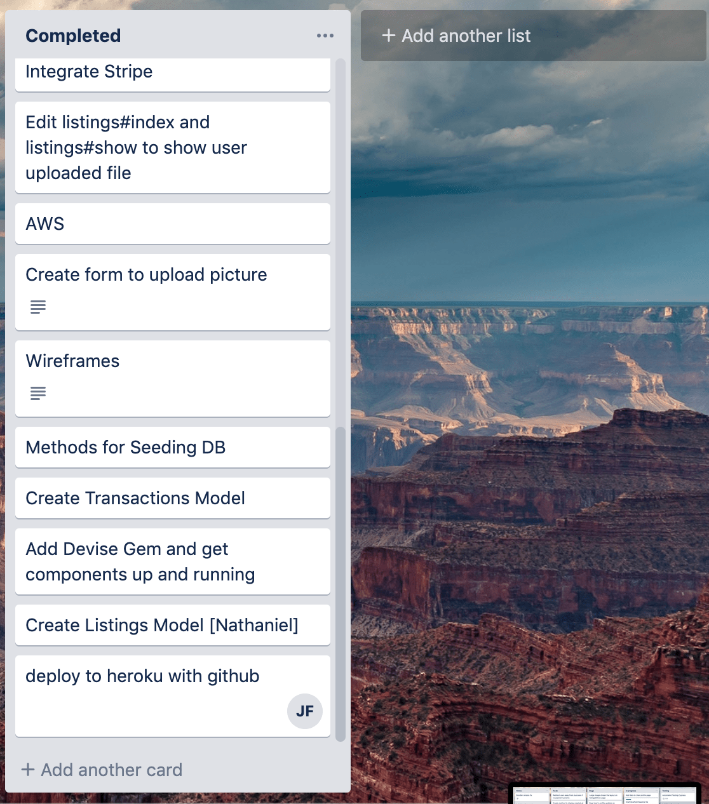

---

**<h2>Section 4.1 Short Answer Questions<h2>**

---

<h4>1. What is the need (i.e. challenge) that you will be addressing in your project?</h4>
There is a gap in the market for mystery boxes that people can send to each other. Rather than going onto shopping platforms specifically looking for mystery boxes, we decided to create a platform directly for this niche.

---

<h4>2. Identify the problem you’re trying to solve by building this particular marketplace App? Why is it a problem that needs solving?</h4>

The problem we’ve created a solution for relies on no shopping platform directed at the selling and buying of other peoples mystery boxes. Rather than having to go through a general shopping platform, we decided to bring all the buyers and sellers under one roof conducting transactions between each other.

---

<h4>3. Describe the project will you be conducting and how. your App will address the needs.</h4>

The project we’ve conducted was to create a way for the target audience to be able to buy and sell mystery boxes under one roof rather than having to use other shopping platforms. Our app we’ve conducted links buyers and sellers under one roof for one common task/goal.

---

<h4>4. Describe the network infrastructure the App may be based on.</h4>

Our app uses the Ruby on rails framework. Our App is hosted on the world wide web through heroku that makes it accessible to others by being able to send through http requests through URLS through the browser which sends it to our rails application Puma which communicates to take in the requests and provide the correct requests which are sent back up the chain back to the user.

---

<h4>5. Identify and describe the software to be used in your App.</h4> 
The software we used in this project includes:

1. Ruby on Rails. (Frame work)
   Is a Web Framework that allows us to rapidly deploy a site onto the web and have access.

2) Bundler (GEM)
   Provides a consistent Ruby project environment to track and install the required gems for the application.

3. Devise (Gem)
   A way for our webapp to authenticate users signing in and out.

4) Faker (Gem)
   A gem to help populate a test database with information for testing.

5. Bootstrap (Gem)
   Used to rapidly create mobile first website layout and styling utilising CSS, HTML and Javascript.

6) AWS (Gem) (Active Storage)
   A gem to enable us to have users upload images to the Amazon storage base without saving it to our local machine.

7. Stripe (Gem) (Online payment system)
   A gem to enable us to have payment transactions within our site hosted by Stripe.

8) Cypress On rails (Gem) (Automated Tester)
   A gem for automated web browser testing of our website to ensure things are working accordingly or not depending on the tests you run.

9. Database_cleaner (Gem) (Add on for Cypress on Rails)
   A gem add-on to for Cypress to enable us to clean the database when instructed to.

---

<h4>6. Identify the database to be used in your App and provide a justification for your choice.</h4>

For our application, we used Postgresql. Postgresql is a relationational database system that works with deploying to Heroku rather than the default database rails gives us which is SQL lite. It synergizes extremely well with Rails and thus has a few helper methods in built into it.

---

<h4>7. Identify and describe the production database setup.</h4>

Heroku offers a free postgresql add-on for applications using their platform. The add-on was attached and setup automatically during the initial deployment.

Setting up our production database was as simple as editing the application’s ‘database.yml’ and ‘storage.yml’ files to include the environment variables being used for our credentials in the production environment (the heroku dyno) and run a few commands.

In development we would use commands like, `rake db:setup` and `rake db:reset`. However these commands aren’t permitted in our Heroku production environment.

To create our tables and run our migrations we run:

`heroku rake db:schema:load` or `heroku rake db:migrate`

Then to add our seed data:

`heroku rake db:seed`

If at some point we need drop our database tables and start fresh:

`heroku pg:reset DATABASE`

---

<h4>8. Describe the architecture of your App.</h4>

The architecture of our App uses Ruby on Rails Framework. Inside this framework, we have 6 architectural components which include: Models, Routes, Controllers, Views, Assets and Rails itself.

---

<h4>9. Explain the different high-level components (abstractions) in your App.</h4>

In our application we used Ruby on Rails. Within the framework there are best practices to follow to ensure that if anyone was to work on your code, regarding what they’re looking for they would be able to find.

We used the Model, View and Controller components for our App.

We kept all our logic inside our controllers which would glue the view and model together so they could communicate to each other, in some instances a view would not be needed to be rendered.

For our views, anything relating to being viewed on the screen was located in our views component. There was very little logic inside our views and if there were, it would be simple if statements. For example, if someone is logged in they should be able to see this information/button else it would either render nothing or a message telling the user to sign in to be able to do this feature.

For our models, it was simply to ensure that our data was passed through and placed into the database or retrieved as well as creating associations for models so that they could in fact interact with other models to to retrieve, update any data.

Our routes are the pathways the controller uses to know where to direct the user or information to.

The assets are where we keep our styling sheets, images to be used, sound files etc that our app may be required to use if requested.

---

<h4>10. Detail any third party services that your App will use.</h4>

1. AWS
   A way for Users to upload images to the site that are saved to a third party cloud in order to not have files saved onto our local machines.

2. Stripe
   A way for Users to buy and sell online using their credit cards in a safe environment.

3. Heroku
   A way for our application to be deployed online to the world wide web.

---

<h4>11. Describe (in general terms) the data structure of marketplace apps that are similar to your own (e.g. eBay, Airbnb).</h4>

The data structure of similar apps to ours would have a users table for users, a seperate table for product_orders, another separate table for listings however, they are all linked together to interact with one another. This way, each table is broken down into smaller easier to manage databases that functions for one thing but can be connected to other tables depending on what your application needs to do with the data.

---

<h4>12. Discuss the database relations to be implemented.</h4>

The database relations to be implemented is to have primary and foreign keys. All our models are based around our user model. This way,we create the relations between different databases so they can communicate with each other whilst still being a separate entity.

---

<h4>13. Describe your project’s models in terms of the relationships (active record associations) they have with each other. </h4>

Our Models communicate to each other through associations. Depending which model it is will determine its association to other tables such as having:

Belongs_to

Has_many

Has_many THROUGH another

That way each table can interact with each other whilst still being a separate entity. For example, a listing belongs_to a user where as a user has_many listings. A product order belongs to a user and listing while a listing has_one product order and a user has_many product orders.

---

<h4>14. Provide your database schema design.</h4>

Our Database Schema Design
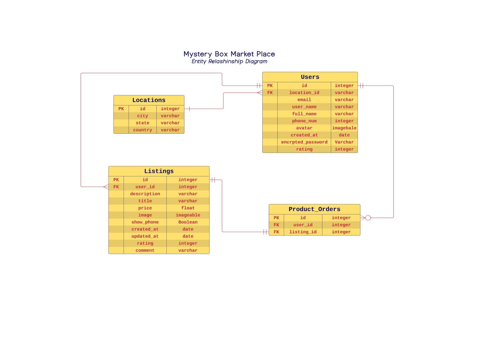

---

<h4>15. Provide User stories for your App.</h4>

User Stories:

- As Nathaniel, I want to be be able to give someone a unique gift because I am utterly clueless at gifting ideas.

* As Joshua, I want to be able to sell items lying around my house to clean up clutter and make some cash.

- As Jim, I want to purchase a surprise item because I'm curious and have cash lying around.

* As Bob, I want to buy other peoples unwanted items in case there's something valuable to salvage or sell.

- As Hawthorne, I want to get rid of unwanted items and would like to get paid something for it.

---

<h4>16. Provide Wireframes for your App.</h4>

Landing Page

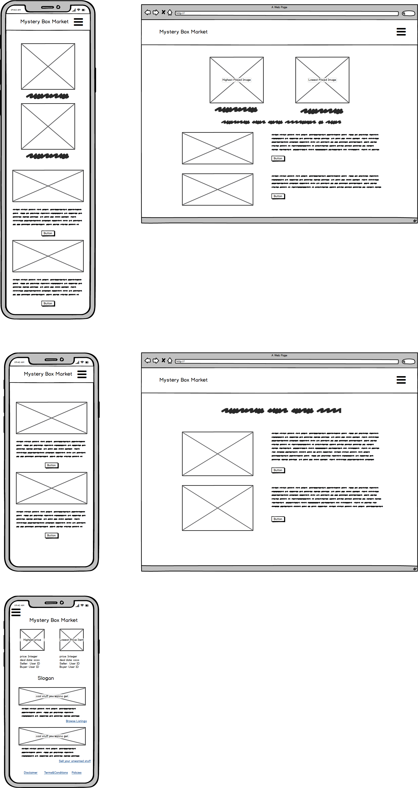

Listing Page
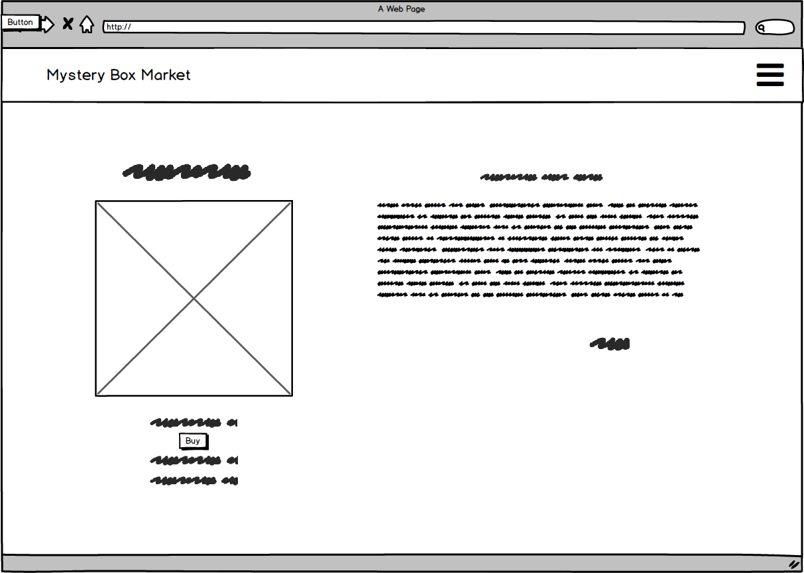

Creating a new listing or edit a listing.
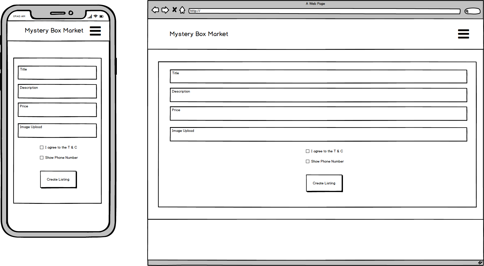

The Listing Page.
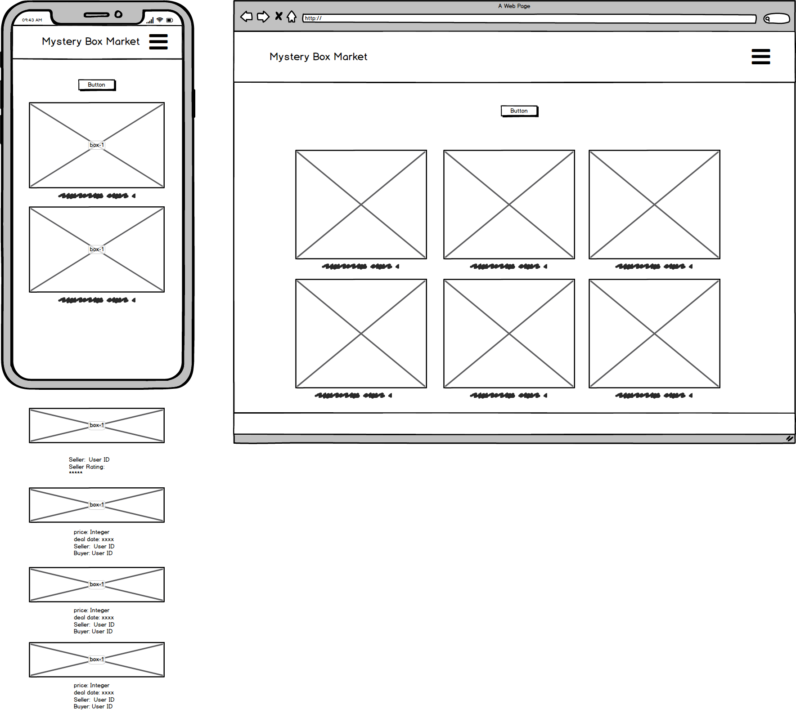

Mobile Home Page.
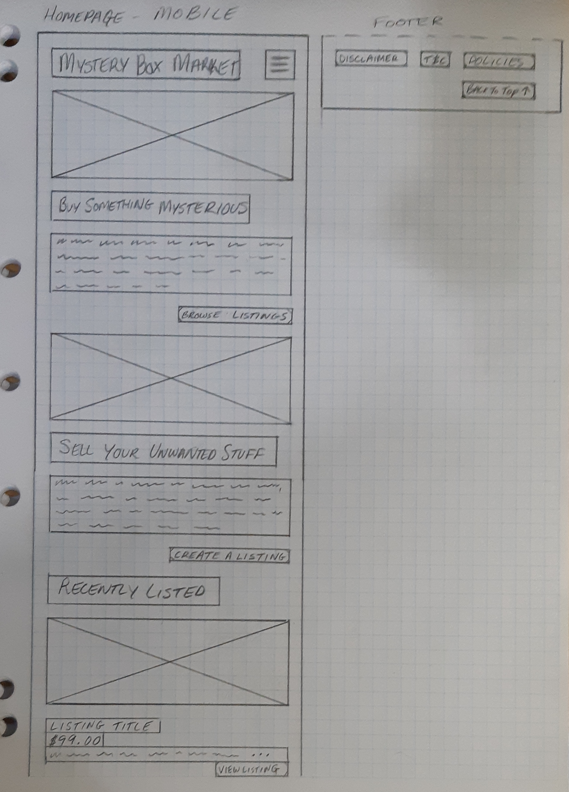

Mobile Listing Page.
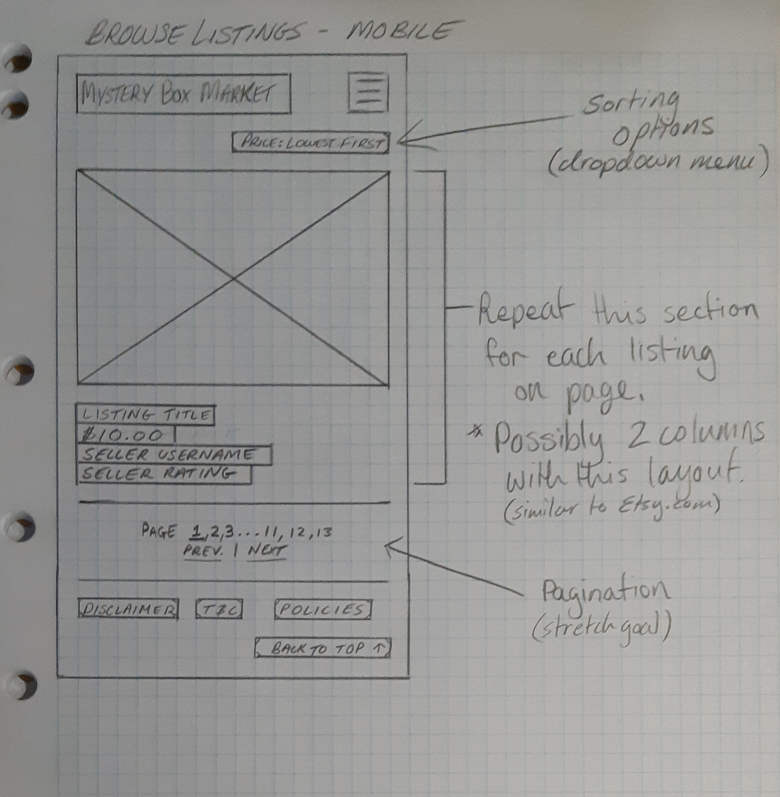

Nav Bar Links
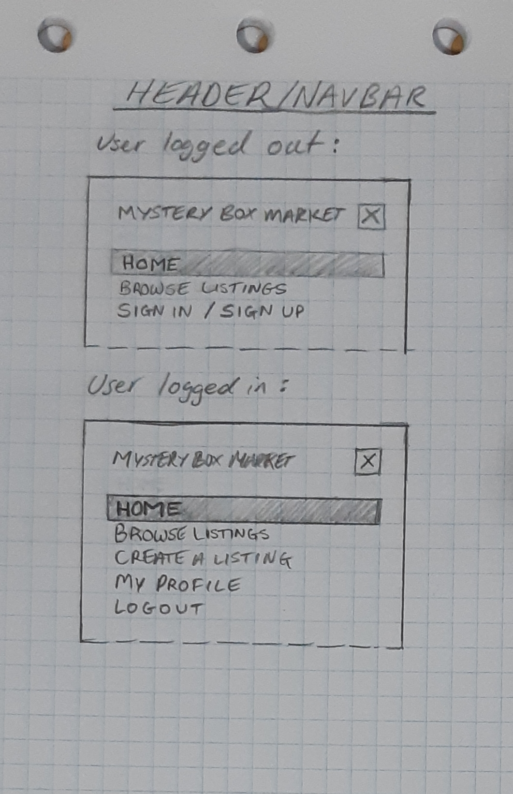

Nav Bar Links with mark up.
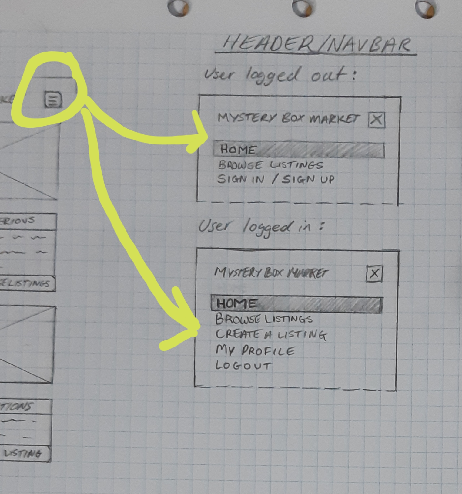

User Profile Page
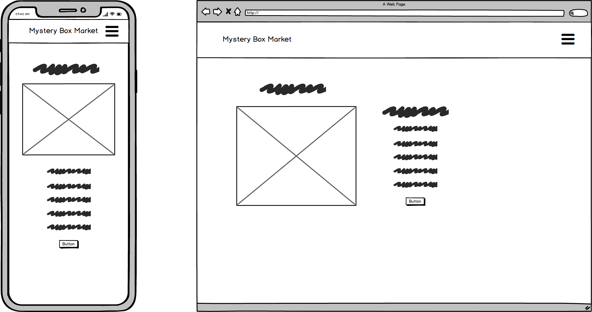

Register, Log in and Account settings page.
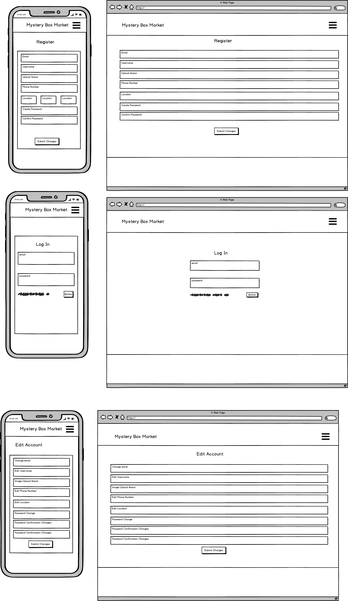

---

<h4>17. Describe the way tasks are allocated and tracked in your project.</h4>

There is a group discussion at the start of the day outlining the plans for the current day. What tasks need to be done, any brief discussions on current tasks i.e any issues that may be faced with the said task such as blockages in the work flow.

During the day while we’re working, we’ll communicate often, usually through slack detailing any issues we’re coming up with and letting each other know where we are on our current tasks for the day. Trello comes into place here as a we will also place cards of what we’re doing up on trello including any bugs or errors that we’ll encounter.

---

<h4>18. Discuss how Agile methodology is being implemented in your project.</h4>

Discuss the feature that needs to be created, going over the wireframes and its core features/functionalities. Once the initial design plans have been laid out, we’d create that function or feature and test to see if it’s basic core functions work as expected and throws intended errors. From that point, it would go into testing from another member of the team to deliberately try to break that function and if all goes accordingly, it is then moved to the styling stage and refining process over a short time period.

---

<h4>19. Provide an overview and description of your Source control process.</h4>

For our source control system in place we used Github. Our process to use github was to all clone from a single repo created by a member of the team and from that master branch we then created another branch called Dev.

Once the initial setup of the app was created and we were all up to date with the repo, we then created our own branches off from dev.

To ensure we did not have any merge conflicts issues, each member was given a certain feature to work from and once the feature was created and was working they’d push their work up to github. Someone on the team who didn’t write the code would then do a pull request from that branch going into the dev branch ensuring that the file was able to be merged and to go over all the changes added or removed.

On regular intervals once dev branch has been updated to the latest version, we would all pull from the dev origin into our local machine then merge and repeat the process to ensure that we were all up to date.

---

<h4>20. Provide an overview and description of your Testing process.</h4>

Automated Testing to see if a certain part of an app runs as intended or halts or throws back errors when intended.

Along with automated testing, we would also go into apps intentionally trying to break it in order to do the said task.

---

Throughout the day, we would also manually test our partners code and give feedback if anything was found or not. This would happen frequently through the day while we’re working on our own code or having a break. If something on our code is not working as intended for example, we’ll go back and check the all the other features to see if the same error/bug was present and if so, inform the person who was in charge of it an provide a solution if not discuss a solution to be implemented to fix that issue.

---

<h4>21. Discuss and analyse requirements related to information system security.</h4>
The fundamental purpose of information system security is to protect infernal information from internal, external, and natural threat.

To ensure information system security, information source authentication, access control, no illegal software residency, no unauthorized operation is required. The information system security mechanism shall judge the source of the information, it shall identify the information of the counterfeit source.

It can ensure that the confidential information is not eavesdropped or its true meaning cannot be understood by eavesdroppers. It can ensure data consistency and prevent data from being tampered with by illegal users. It can ensure that the use of information and resources by legitimate users isnot improperly rejected. It can help establish an effective accountability measures to prevent users from denying their behavior, which is extremely important in e-commerce. It can control over the dissemination and content of information.

---

<h4>22. Discuss methods you will use to protect information and data.
</h4>

- Regular backup and remote storage of the most important data files in the computer system

- Duplication and backup of all network subsystems that are important for data security

- Possibility to reallocate network resources in case of the malfunctions of individual elements

- Possibility to use backup power supply systemsEnsuring safety from fire or water damage

- Installation of the software that protects databases and other information from unauthorized access.

- Usage of identification and authentication to prevent unauthorized access to information. Authenticity will also be established by programs, apparatus and by men. Apart from aperson being an object of authentication, it can extend to hardware (computer, monitor and carriers) or data. Setting a password is the easiest method of protection.

---

<h4>23. Research what your legal obligations are in relation to handling user data.
</h4>

According to Australia’s Privacy law, the Privacy Act 1988 which regulates the handling of personal information about individuals. We have the responsibility to protect personal information from theft, misuse, interference, loss, unauthorized access, modification, disclosure.

We shall also take reasonable steps to destroy or de-identify personal information when it is no longer needed for any purpose permitted under the Privacy Act 1988. This might include shredding documents or storing them in a secure area.

According to Australian Privacy Principles (APPs)

- We must implement practices, procedures and systems to ensure compliance with the APPs and to handle complaints.

- We must make available an up-to-date and clear privacy policy, setting out certain information on how we will manage personal information.

- We must take reasonable steps to protect the personal information collected or held.

- We must take reasonable steps to ensure that personal information collected is accurate, complete and up to date.

- We must give individuals access to their personal information on request.

- We must correct personal information where we become aware that it is either:oinaccurateoincompleteoout of dateoirrelevantomisleadingowhere requested by the individual.

- We can only collect personal information if it is necessary for the function or activity of our business.

- We must de-identify or delete unsolicited personal information as soon as is practical, if it is not necessary for the function or activity of our business.

- We should not use or disclose personal information for a purpose different from the original purpose of collection, except in limited circumstances.

- Although we can collect and use personal information, we generally need the individuals consent first.

- We must not use or disclose personal information for a direct marketingpurpose, except in limited circumstances.
  - We need to have a clear and up to date privacy policy that outlines the information we:
    - collect
    - what we use it for
    - how we protect it
